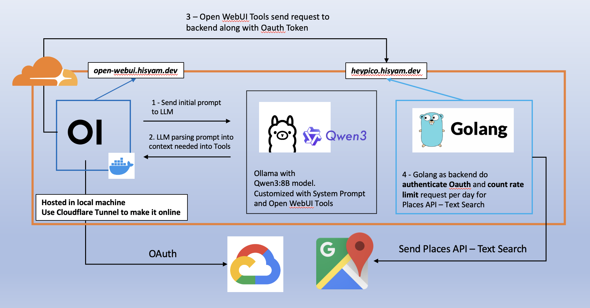

# Code Submission for HeyPico.AI Test

## Objective

Run local LLM that can output Google Map's embedded map directly in LLM chat interface when user prompting where to find places to go/eat/etc.

## Planned Architecture

## User Request Flow

1. User asking nearby places with certain parameters that has to meet upon (regarding Google Maps Place - Text Search Api - Request Body)
2. LLM make sure user satisfied the required parameters by sending feedback and asking response. This can be satisfied by using System Prompt on model config. Set {{USER_LOCATION}} variable and toggle location permission by default to on (by admin) so user Lat, Long is sent to `Tools`
3. LLM make request to backend
4. Backend do authenticate user (checking the oauth token) and count request count on Google Maps Place - Text Search API
5. If user is valid and count request has not reach limit per day (Text Search free cap is 10,000 call per month - around 300 per day), send request to Google API
6. Backend response top 5 Place objects back to LLM
7. LLM show the results to user and offer user to choose 1 from top 5 places. LLM will show the directions and estimated time
8. User choose 1 Place object
9. LLM will show Google Maps embedded view with *directions* type

## WIP

- LLM can show Google Maps embedded view with *directions* type. `Origin` and `Destination` based on user prompt. Also `Mode` and `Avoid`

